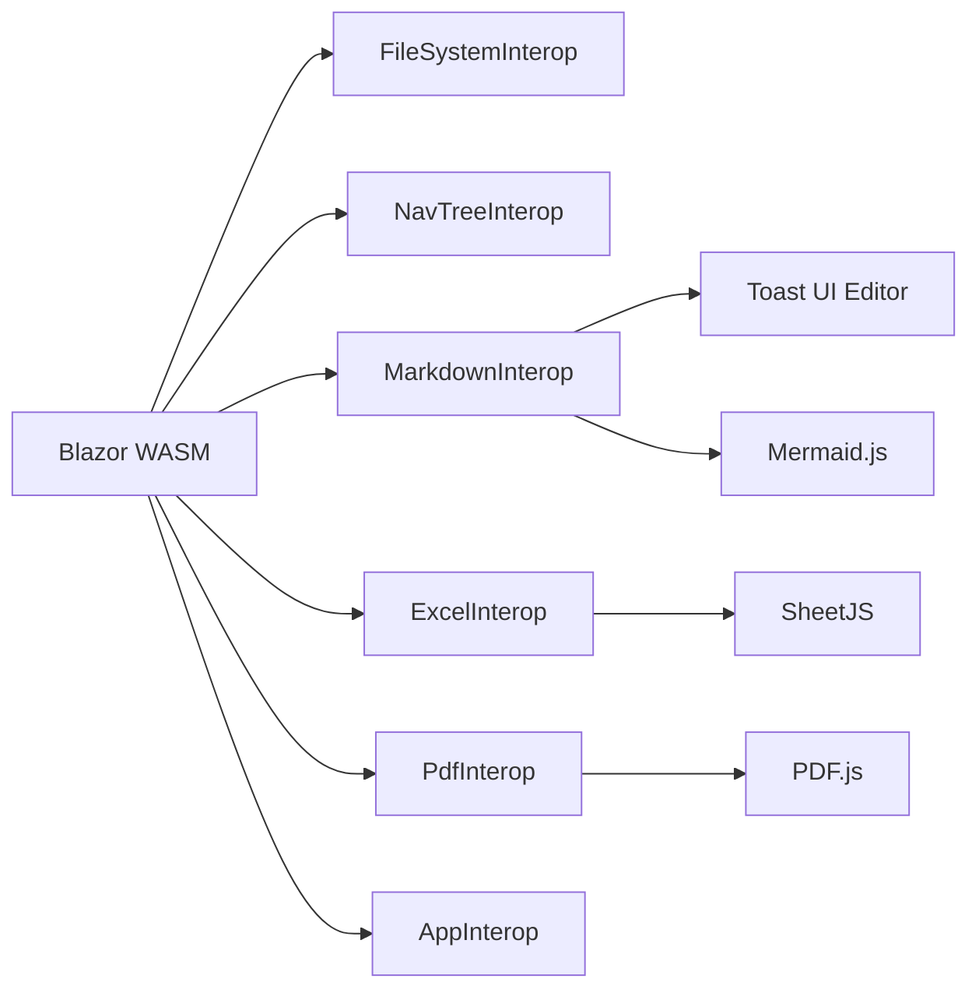

# API Reference

This document describes the JavaScript interop modules used by the File Viewer application.

## Modules Overview

## FileSystemInterop

Handles file system operations via the File System Access API.

| Method | Parameters | Returns | Description |
|--------|-----------|---------|-------------|
| `checkSupport()` | — | `boolean` | Check if File System Access API is available |
| `requestAccess()` | — | `boolean` | Open directory picker for read/write access |
| `saveFile(path, content)` | `string, string` | `void` | Save content to a file at the given path |
| `readFile(path)` | `string` | `string` | Read file content at the given path |

## MarkdownInterop

Manages the Toast UI Editor instance.

| Method | Parameters | Returns | Description |
|--------|-----------|---------|-------------|
| `render(content, filePath)` | `string, string` | `void` | Create editor with content |
| `getMarkdown()` | — | `string` | Get current markdown content |
| `hasDirtyChanges()` | — | `boolean` | Check if content has been modified |
| `destroy()` | — | `void` | Clean up editor instance |

## ExcelInterop

Renders spreadsheet files using SheetJS.

| Method | Parameters | Returns | Description |
|--------|-----------|---------|-------------|
| `renderFromUrl(url, filename, filePath)` | `string, string, string` | `void` | Load and render from URL |
| `renderFromHandle(filename, filePath)` | `string, string` | `void` | Load from file handle |
| `getCSVContent()` | — | `string` | Get edited CSV content |
| `isEditable()` | — | `boolean` | Check if current file is editable (CSV) |

## PdfInterop

Renders PDF files using PDF.js.

| Method | Parameters | Returns | Description |
|--------|-----------|---------|-------------|
| `renderFromUrl(url)` | `string` | `void` | Load and render PDF from URL |
| `nextPage()` / `prevPage()` | — | `void` | Navigate between pages |
| `zoomIn()` / `zoomOut()` | — | `void` | Adjust zoom level |
| `fitWidth()` | — | `void` | Fit PDF to viewer width |
