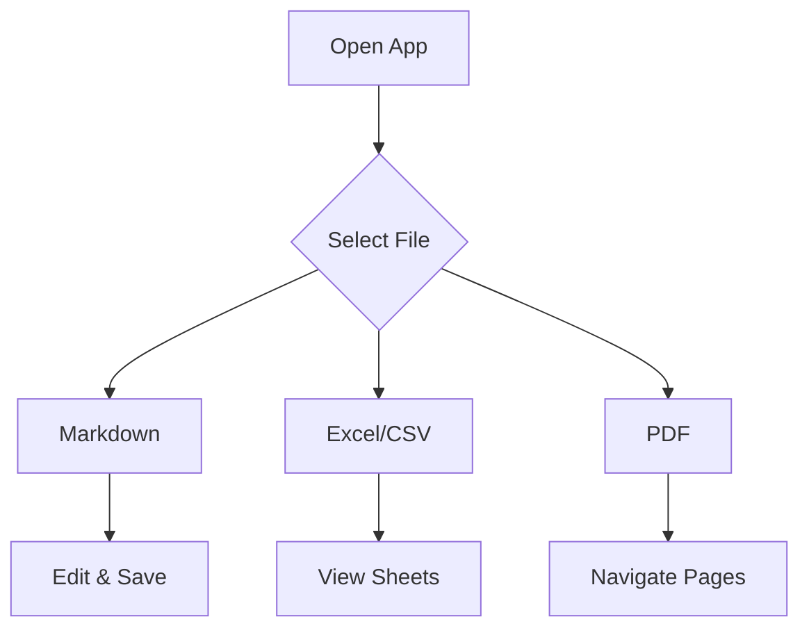

# Welcome to File Viewer

This is a **Blazor WebAssembly** application for viewing files directly in your browser.

## Supported File Types

- **Markdown** (`.md`) — Full WYSIWYG editing with [Toast UI Editor](https://ui.toast.com/tui-editor)
- **Excel** (`.xlsx`, `.xls`, `.csv`) — Spreadsheet viewing with [SheetJS](https://sheetjs.com/)
- **PDF** (`.pdf`) — Document viewing with [PDF.js](https://mozilla.github.io/pdf.js/)

## Features

1. **File Tree Navigation** — Browse files from the sidebar
2. **Dark/Light Theme** — Toggle between themes
3. **Open Local Folders** — Use the File System Access API to open folders from your filesystem
4. **Save Changes** — Edit markdown and CSV files, then save back to disk
5. **Mermaid Diagrams** — Render diagrams in markdown files

## Mermaid Diagram Example

## Getting Started

Select a file from the sidebar to begin exploring. You can also click **Open Folder** to browse files from your local filesystem.

> **Tip:** Use `Ctrl+S` (or `Cmd+S` on Mac) to save your changes.
